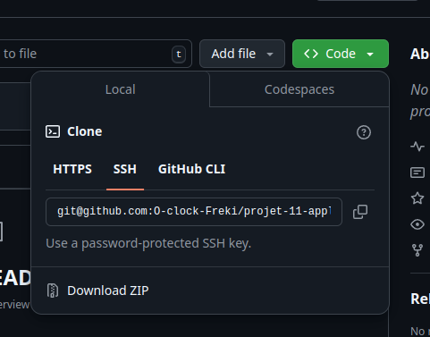

# Mise en route du projet

## Cloner le projet

Ouvrir un terminal et éxécuter la commande:
``` bash 
git clone git@github.com:O-clock-Freki/projet-11-application-de-gestion-de-photos.git
```
Sinon se rendre sur le site https://github.com/O-clock-Freki/projet-11-application-de-gestion-de-photos et cliquer 
sur le bouton <>Code puis cliquer sur
Download ZIP


## Installer les dépendances

Ce rendre dans le dossier récupéré depuis Github (par défaut dans le dossier de téléchargmeent de votre système,  et dézippé dans le dossier de votre choix ou dans le dossier récupérer avec la commande git clone)

Ouvrir un terminal:
``` bash
cd FrontOffice
npm install
```
pour installer les dépéndances frontend du projet

puis :
``` bash
cd ..
```
``` bash
cd Api
npm install
```
pour installer les dépendances backend du projet
puis 
``` bash
cd ..
```
pour revenir au dossier racine.

## Créer un fichier .api.env
Copier coller le ficher .api.env.exemple dans un fichier .api.env et remplir les champs
 en remplacant les valeurs (username, password et database) par les bonnes valeurs

## Démarrer le projet avec docker 

* Si pas de docker installé sur votre machine, installer docker à l'adresse https://docs.docker.com/engine/install/

Une fois installé, à la racine du projet (projet-11-application-de-gestion-de-photos), lancer un terminal et éexécuter la commande 

Pour Windows

``` bash
docker compose build 
``` 

``` bash
docker compose up -d
``` 

``` bash
cd Api
``` 

``` bash
npm run prisma
``` 


Pour linux et macOS

``` bash
sudo docker compose up
``` 

``` bash
cd Api
``` 

``` bash
npm run prisma
``` 
## Se rendre sur le projet déployé

Une fois le projet démarré, accéder à l'application aux adresses:
- Pour le front :  http://localhost:5173 ou http://frontoffice-westiti.localhost

- Pour le back/API :  pour le frontend, et http://localhost:3000 ou http://api-westiti.localhost