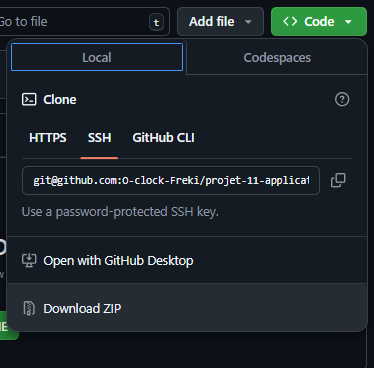
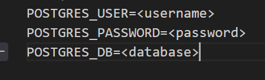

# Mise en route du projet

## Cloner le projet

Ouvrir un terminal et éxécuter la commande:
``` bash 
git clone git@github.com:O-clock-Freki/projet-11-application-de-gestion-de-photos.git
```
Sinon se rendre sur le site https://github.com/O-clock-Freki/projet-11-application-de-gestion-de-photos et cliquer 
sur le bouton <>Code puis cliquer sur
Download ZIP


## Installer les dépendances

Ce rendre dans le dossier récupéré depuis Github (par défaut projet-11-application-de-gestion-de-photos, ou téléchargé et dézippé dans le dossier de votre choix)

Ouvrir un terminal:
``` bash
cd FrontOffice
npm install
```
pour installer les dépéndances frontend du projet

puis :
``` bash
cd ..
```
``` bash
cd Api
npm install
```
pour installer les dépendances backend du projet

## Créer un fichier .api.env
Copier coller le ficher .api.env.exemple dans un fichier .api.env et remplir les champs
 en remplacant les valeurs (username, password et database) par les bonnes valeurs

## Démarrer le projet avec docker 

* Si pas de docker installé sur votre machine, installer docker à l'adresse https://docs.docker.com/engine/install/

Une fois installé, à la racine du projet (projet-11-application-de-gestion-de-photos), lancer un terminal et éexécuter la commande 

Pour Windows
``` bash
docker compose up
``` 


Pour linux et macOS

``` bash
sudo docker compose up
``` 


## Se rendre sur le projet déployé

Une fois le projet démarré, accéder à l'application à l'adresse http://localhost:5173 pour le frontend, et http://localhost:3000 pour l'api Démarerr le projet en mode dev: 
 
 le docker.override vient ecraser des varaiable u docker-compose  afin de démarrer en mode developpement
 
 docker-compose -f docker-compose.yml -f docker-compose.override.yml up -d